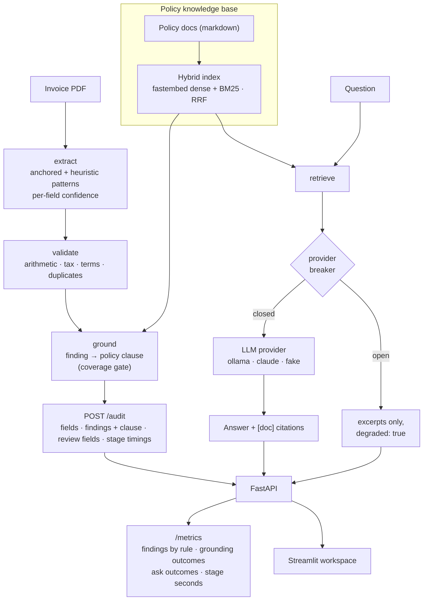
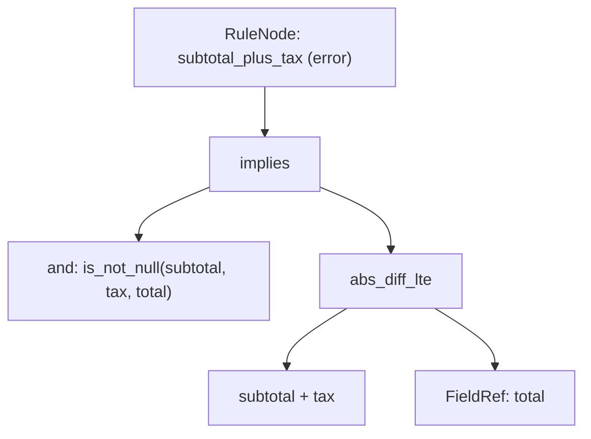

<div align="center">


</div>

# LedgerLens — Invoice AI & Audit

**Read an invoice PDF, check its bookkeeping, tie every problem to the policy clause that governs it, and answer expense-policy questions with citations.** LedgerLens extracts fields from invoice PDFs with per-field confidence, runs an explainable accounting-rules engine over them, looks up the governing policy clause for each finding, and answers free-form policy questions with hybrid retrieval and cited answers. Its distinctive piece is a small **declarative rules DSL**: audit rules are expressed as an Abstract Syntax Tree and evaluated by a pure tree-walking interpreter, so the validation logic is data you can read and extend, not buried `if`/`else`.

<div align="center">

[](https://www.python.org/)
[](https://fastapi.tiangolo.com/)
[](https://pytest.org/)
[](https://opensource.org/licenses/MIT)

</div>

---

## The problem

Accounts-payable teams face the same questions on every invoice: did we read the numbers off it correctly, do those numbers add up and obey policy, and — when they don't — what does policy say we do about it? Each is usually solved by a different tool, and the audit logic tends to rot into a tangle of hard-coded conditions that nobody wants to touch.

LedgerLens tackles them in one small, honest pipeline:

- **Extract** — pull invoice number, dates, vendor, subtotal/tax/total, and line items from a PDF, tagging every field with a confidence score so low-confidence reads route to human review.
- **Audit** — run ordered, explainable rules (line-item math, subtotal + tax = total, plausible tax rate, payment terms, duplicate invoice numbers) and emit structured findings with severities and readable messages.
- **Ground** — attach to each finding the policy clause that governs it ("Suspected duplicates are routed to the accounts-payable review queue and must not be paid until cleared"), or say honestly that no clause applies.
- **Ask** — answer expense-policy questions from the policy knowledge base with `[doc]` citations, and keep serving the retrieved excerpts when the LLM is down.

## How it works



The FastAPI service exposes the staged audit, the batch ledger/findings, policy Q&A, and Prometheus-style counters; the Streamlit app is a thin client over that API.

## The rules engine (declarative DSL + AST interpreter)

The accounting checks exist in two forms that mirror each other. The shipped batch pipeline and the `/extract` and `/audit` endpoints use ordered Python validators in `validation/rules.py` — pure functions that each return findings with a severity and a human-readable message. The arithmetic and tax checks are also expressed **declaratively** in `rules_engine/` as an Abstract Syntax Tree, evaluated by a small tree-walking interpreter, and a test holds the two implementations to the same verdicts on the same invoices. That DSL is the pattern this project is built to showcase: audit logic as inspectable data rather than control flow.

### Expression grammar

| Node | Role |
|---|---|
| `FieldRef` | Reads a field from the invoice context; numeric values are coerced to `float`, missing values stay `None` |
| `Literal` | Constant scalar |
| `BinaryOp` | Arithmetic (`+ - * /`) and comparison (`== != < <= > >=`, plus `abs_diff_lte`) |
| `UnaryOp` | `not`, `abs` |
| `ConditionNode` | Boolean logic: `and`, `or`, `not`, `implies`, `is_not_null`, `is_null` |
| `RuleNode` | A named rule = condition + severity (`error`/`warning`) + message template |

Evaluation is **null-safe** (any `None` operand short-circuits) and float comparisons use a configurable **tolerance** (`amount_tolerance`, default 0.02) so cents-level rounding doesn't raise false errors. A rule *passes* when its condition evaluates `True`; a `False` result produces a finding with an interpolated message.

For example, "subtotal + tax must equal total" is the tree:



### The accounting checks

- **Line-item integrity** — $\left|\sum_i (\text{qty}_i \times \text{price}_i) - \text{subtotal}\right| \le \epsilon$
- **Grand-total integrity** — $\left|(\text{subtotal} + \text{tax}) - \text{total}\right| \le \epsilon$
- **Tax-rate plausibility** — $\dfrac{\text{tax}}{\text{subtotal}} \le \text{max\_tax\_rate}$ (default 0.30)
- **Payment terms** — due date not before issue date; terms past `due_days_approval` (60) are a *warning* that needs CFO sign-off, terms past `due_days_max` (120) are an *error*, matching what the expense policy actually says. (The rule used to warn at 120 only, which quietly capped validation recall at 87.5% on the shipped corpus because the eval counts overdue terms as an injected error.)
- **Duplicates** — the same invoice number seen across two files is flagged
- **Required fields** — missing `invoice_no`, `vendor`, or `total`

## Grounding findings in policy

A finding tells a clerk *what* is wrong; the policy clause tells them *what to do*. `POST /audit` runs extract → validate → ground and returns, for each finding, the governing clause with its document and section:

```json
{"rule": "duplicate_invoice_no", "severity": "error",
 "message": "Invoice number INV-20260007 already seen in invoice_0007.pdf",
 "policy": {"doc": "expense-policy", "section": "Duplicate handling",
            "excerpt": "An invoice number may be paid exactly once per vendor. Suspected duplicates are routed to the accounts-payable review queue ..."}}
```

Each rule id carries a short retrieval query written by the rule's author (`gateway/grounding.py`); rules that no policy addresses (`missing_fields`, `dates_unparseable`) are declared ungrounded, and a test checks that every rule id the validators declare has been put in one list or the other. The query is run through the same hybrid index as policy Q&A.

Citing the wrong clause is worse than citing none, so a **gate** decides whether the top chunk is trustworthy. Two designs were measured on a labelled set of 160 findings from 240 synthetic invoices (every injected error kind plus hand-broken invoices), and on an ablation that deletes each rule's governing clause from the policy docs and checks whether grounding still cites *something*:

| query source | gate | precision (findings with a clause) | false citations (findings without one) | still cites after clause deleted |
|---|---|---|---|---|
| finding message | none | 67.5% | 100% | — |
| finding message | retrievers agree + BM25 margin | 59.0% | 0% | — |
| author's query | none | 100% | 0% | 7 / 7 rules |
| author's query | retrievers agree | 100% | 0% | 5 / 7 |
| author's query | agree + BM25 margin ≥ 2 | 100% | 0% | 3 / 7 |
| author's query | **word coverage ≥ 50%** (shipped) | 100% | 0% | **0 / 7** |

Two things fell out of this. Using the finding's own message as the query looked attractive (no table to maintain) but arithmetic findings are pulled towards the *tax* policy by the word "tax", and the margin gate is degenerate when nothing else matches at all — a single shared word ("line", "tax") wins by an infinite margin. Requiring the clause to contain at least half the words of the author's query is simpler and was the only gate that refused every substitute clause. The thresholds were chosen looking at these seven cases and four short policy documents; treat the table as a description of this corpus, not a general result.

```bash
uv run python scripts/grounding_eval.py --verbose   # reproduces the table
```

## Policy Q&A, and what happens when the model is down

Policy markdown is chunked by `##` section and indexed two ways — dense embeddings (`fastembed`, `all-MiniLM-L6-v2`) and lexical BM25 — then a query's two ranked lists are combined with **Reciprocal Rank Fusion** ($\text{score} = \sum 1/(60 + \text{rank})$). The top chunks become context for a swappable LLM provider (`ollama`, `claude`, or a deterministic `fake` for tests) that is instructed to answer only from the excerpts and cite them as `[doc-name]`.

The default provider is a local Ollama daemon, and on a developer machine it is often not running. `/ask` therefore goes through a per-provider **circuit breaker** (`gateway/circuit.py`): retrieval always runs, and if the provider call fails the response still carries the retrieved excerpts with `"degraded": true` and the reason instead of a 500. After three consecutive failures the circuit opens and questions are answered from excerpts alone without touching the provider for 30 s; then exactly one probe call is let through, and its result closes the circuit or re-opens it for another cooldown. `/health` reports the circuit state and `/metrics` counts answered, degraded, and rejected questions.

## Getting started

```bash
make install                 # uv sync --group dev
```

Generate the synthetic corpus and build the artifacts the API serves:

```bash
uv run python -m ledgerlens.corpus.generate     # invoice PDFs + ground-truth JSON
uv run python -m ledgerlens.extraction.pipeline # extract + validate -> data/ledger.parquet
uv run python -m ledgerlens.rag.policies        # write the policy knowledge base
```

Then run the services:

```bash
make api                     # FastAPI on http://localhost:8070
make ui                      # Streamlit workspace on http://localhost:8571
```

Policy Q&A defaults to a local `ollama` provider; set `LLM_PROVIDER=claude` with `ANTHROPIC_API_KEY` to use Claude, or `LLM_PROVIDER=fake` for offline/deterministic runs (see `.env.example`).

Or with Docker:

```bash
make docker-up               # docker compose up --build -d
make docker-down
```

## API

| Method | Route | Purpose |
|---|---|---|
| `GET` | `/health` | Liveness check, active LLM provider, and its circuit state |
| `GET` | `/metrics` | Prometheus text: findings by rule, review fields, grounding outcomes, ask outcomes, stage seconds |
| `GET` | `/ledger?limit=N` | Processed invoices from the batch ledger |
| `GET` | `/findings` | Ledger invoices with one or more audit findings |
| `POST` | `/extract` | Upload a PDF; fields + findings, no policy lookup |
| `POST` | `/audit` | Upload a PDF; fields, findings with governing clause, review fields, per-stage timings |
| `POST` | `/ask` | Policy question; cited answer, or excerpts only when the provider is unavailable |

## Evaluation

Because the corpus is synthetic, ground truth is known and the pipeline can be scored honestly. `extraction/evaluate.py` measures:

- **Field accuracy** — per-field extraction correctness vs. the ground-truth JSON (money fields matched within 0.01).
- **Validation recall** — fraction of invoices carrying *injected* bookkeeping errors that the rules engine actually flagged.
- **False-alarm rate** — fraction of clean invoices wrongly flagged with an error finding.

On the shipped configuration (60 invoices, seed 42, 16 with injected errors) this reports 100% field accuracy, 100% validation recall, and 0% false alarms; before the payment-terms fix recall was 87.5% (the two overdue-terms invoices were warnings, not errors). The extraction numbers say more about the synthetic layout than about extraction — see Limitations.

```bash
uv run python -m ledgerlens.extraction.evaluate   # metrics are also logged to MLflow
uv run python scripts/grounding_eval.py           # finding-to-policy grounding table above
```

## Testing

```bash
make test                    # uv run pytest --cov
```

- `test_rules_dsl.py` — AST interpreter, the declarative engine on real extractions, and agreement with the imperative validators
- `test_validation.py` — imperative validators (arithmetic, tax, terms at 60/120 days, duplicates)
- `test_extraction.py` — field extraction and confidence scoring
- `test_rag.py` — sectioned chunks, hybrid retrieval, ranked hits, cited answers (via the `fake` provider)
- `test_policy_grounding.py` — finding → clause, ungrounded rules, and refusal when the clause has been deleted
- `test_provider_breaker.py` — breaker state machine on a fake clock; `/ask` degrading instead of raising
- `test_api.py` — HTTP contract: `/audit` grounding, `/metrics` contents, `/ask` outcomes

## Limitations

- Extraction is pattern-based (anchored labels + heuristics), tuned to the synthetic invoice layouts; real-world scans and varied templates would need OCR and more robust parsing.
- The rules cover common bookkeeping and policy checks, not a full accounting standard. Only the arithmetic and tax rules exist in the DSL; dates and duplicates are imperative only.
- Grounding depends on a per-rule query table and a word-coverage gate tuned on four short policy documents; a larger, wordier policy corpus would need the gate re-measured.
- The policy corpus and invoices are synthetic; thresholds (tolerance, max tax rate, term limits) would need recalibration on real data.
- RAG answer quality depends on the configured LLM provider; the bundled `fake` provider is for tests, not real answers.
- Metrics are process-local counters; they reset on restart and are not shared across workers.

## Project structure

```
src/ledgerlens/
├── extraction/     # PDF field extraction + confidence, and the eval harness
├── validation/     # Ordered, explainable accounting validators (used by the pipeline)
├── rules_engine/   # Declarative DSL: AST nodes, tree-walking interpreter, engine
├── rag/            # Policy corpus, hybrid retrieval (dense + BM25 + RRF), cited Q&A
├── gateway/        # Staged audit, finding → policy grounding, breaker-guarded policy Q&A
├── observability/  # Stage timings and domain counters behind /metrics
├── llm/            # Swappable LLM providers: ollama · claude · fake
├── corpus/         # Synthetic invoice + policy generation
├── api/            # FastAPI app (main:app) and routes
└── ui/             # Streamlit workspace
scripts/
└── grounding_eval.py   # query-strategy x gate sweep and clause-removal ablation
```

## License

MIT

---

<div align="center">

**Jackson Marcus** · Senior AI & Machine Learning Engineer

[](https://github.com/jackson-marcus)
[](mailto:wajahatanees41@gmail.com)

</div>
