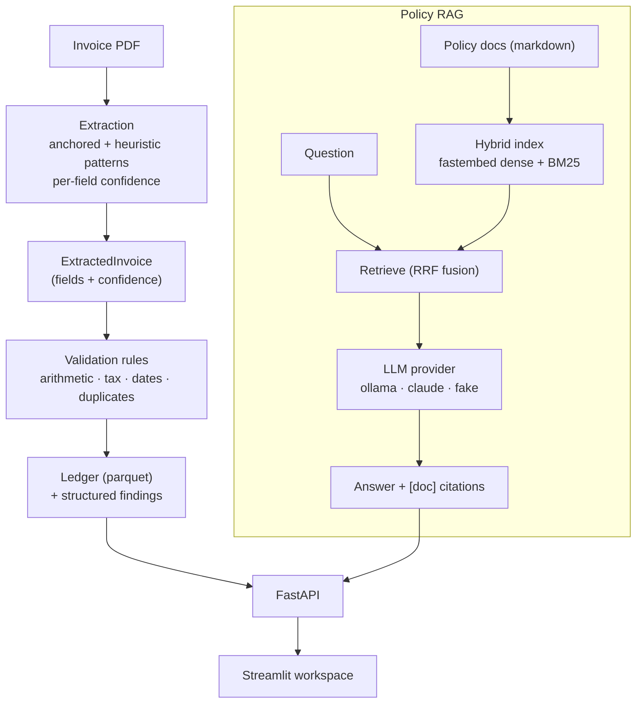
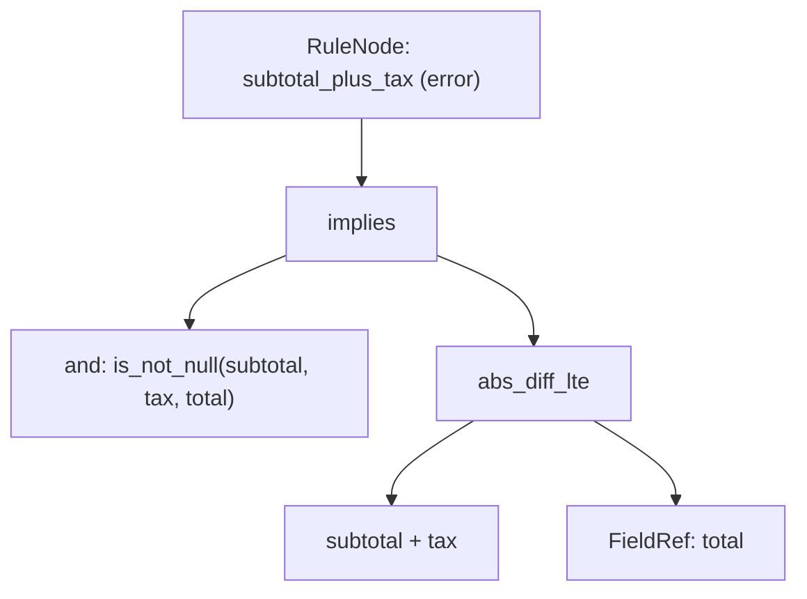

<div align="center">


</div>

# LedgerLens — Invoice AI & Audit

**Read an invoice PDF, check its bookkeeping, and answer expense-policy questions with citations.** LedgerLens extracts fields from invoice PDFs with per-field confidence, runs an explainable accounting-rules engine over them to flag arithmetic and policy violations, and answers questions about expense policy using hybrid retrieval with grounded, cited answers. Its distinctive piece is a small **declarative rules DSL**: audit rules are expressed as an Abstract Syntax Tree and evaluated by a pure tree-walking interpreter, so the validation logic is data you can read and extend, not buried `if`/`else`.

<div align="center">

[](https://www.python.org/)
[](https://fastapi.tiangolo.com/)
[](https://pytest.org/)
[](https://opensource.org/licenses/MIT)

</div>

> **Portfolio project.** Built to demonstrate document extraction, a declarative rules-engine pattern, and cited RAG on realistic (synthetic) invoice data. Not hardened for production use.

---

## The problem

Accounts-payable teams face the same three questions on every invoice: did we read the numbers off it correctly, do those numbers add up and obey policy, and what does our expense policy actually say about this charge? Each is usually solved by a different tool, and the audit logic tends to rot into a tangle of hard-coded conditions that nobody wants to touch.

LedgerLens tackles all three in one small, honest pipeline:

- **Extract** — pull invoice number, dates, vendor, subtotal/tax/total, and line items from a PDF, tagging every field with a confidence score so low-confidence reads route to human review.
- **Audit** — run ordered, explainable rules (line-item math, subtotal + tax = total, plausible tax rate, sane payment terms, duplicate invoice numbers) and emit structured findings with severities and readable messages.
- **Ask** — answer expense-policy questions from a policy knowledge base, grounding every answer in retrieved excerpts with `[doc]` citations.

## How it works



The FastAPI service exposes extraction, the ledger/findings, and policy Q&A; the Streamlit app is a thin client over that API.

## The rules engine (declarative DSL + AST interpreter)

The accounting checks exist in two forms that mirror each other. The shipped batch pipeline and `/extract` endpoint use ordered Python validators in `validation/rules.py` — pure functions that each return findings with a severity and a human-readable message. The same rules are also expressed **declaratively** in `rules_engine/` as an Abstract Syntax Tree, evaluated by a small tree-walking interpreter. That DSL is the pattern this project is built to showcase: audit logic as inspectable data rather than control flow.

### Expression grammar

| Node | Role |
|---|---|
| `FieldRef` | Reads a field from the invoice context; numeric values are coerced to `float`, missing values stay `None` |
| `Literal` | Constant scalar |
| `BinaryOp` | Arithmetic (`+ - * /`) and comparison (`== != < <= > >=`, plus `abs_diff_lte`) |
| `UnaryOp` | `not`, `abs` |
| `ConditionNode` | Boolean logic: `and`, `or`, `not`, `implies`, `is_not_null`, `is_null` |
| `RuleNode` | A named rule = condition + severity (`error`/`warning`) + message template |

Evaluation is **null-safe** (any `None` operand short-circuits) and float comparisons use a configurable **tolerance** (`amount_tolerance`, default 0.02) so cents-level rounding doesn't raise false errors. A rule *passes* when its condition evaluates `True`; a `False` result produces a finding with an interpolated message.

For example, "subtotal + tax must equal total" is the tree:



### The accounting checks

- **Line-item integrity** — $\left|\sum_i (\text{qty}_i \times \text{price}_i) - \text{subtotal}\right| \le \epsilon$
- **Grand-total integrity** — $\left|(\text{subtotal} + \text{tax}) - \text{total}\right| \le \epsilon$
- **Tax-rate plausibility** — $\dfrac{\text{tax}}{\text{subtotal}} \le \text{max\_tax\_rate}$ (default 0.30)
- **Payment terms** — due date not before issue date; term length within `due_days_max` (default 120)
- **Duplicates** — the same invoice number seen across two files is flagged
- **Required fields** — missing `invoice_no`, `vendor`, or `total`

### Policy RAG

Policy markdown is chunked and indexed two ways — dense embeddings (`fastembed`, `all-MiniLM-L6-v2`) and lexical BM25 — then a query's two ranked lists are combined with **Reciprocal Rank Fusion** ($\text{score} = \sum 1/(60 + \text{rank})$). The top chunks become context for a swappable LLM provider (`ollama`, `claude`, or a deterministic `fake` for tests) that is instructed to answer only from the excerpts and cite them as `[doc-name]`.

## Getting started

```bash
make install                 # uv sync --group dev
```

Generate the synthetic corpus and build the artifacts the API serves:

```bash
uv run python -m ledgerlens.corpus.generate     # invoice PDFs + ground-truth JSON
uv run python -m ledgerlens.extraction.pipeline # extract + validate -> data/ledger.parquet
uv run python -m ledgerlens.rag.policies        # write the policy knowledge base
```

Then run the services:

```bash
make api                     # FastAPI on http://localhost:8070
make ui                      # Streamlit workspace on http://localhost:8571
```

Policy Q&A defaults to a local `ollama` provider; set `LLM_PROVIDER=claude` with `ANTHROPIC_API_KEY` to use Claude, or `LLM_PROVIDER=fake` for offline/deterministic runs (see `.env.example`).

Or with Docker:

```bash
make docker-up               # docker compose up --build -d
make docker-down
```

## API

| Method | Route | Purpose |
|---|---|---|
| `GET` | `/health` | Liveness check + active LLM provider |
| `GET` | `/ledger?limit=N` | Processed invoices from the ledger |
| `GET` | `/findings` | Invoices with one or more audit findings |
| `POST` | `/extract` | Upload a PDF; returns extracted fields + findings |
| `POST` | `/ask` | Policy question; returns a cited answer with sources |

## Evaluation

Because the corpus is synthetic, ground truth is known and the pipeline can be scored honestly. `extraction/evaluate.py` measures:

- **Field accuracy** — per-field extraction correctness vs. the ground-truth JSON (money fields matched within 0.01).
- **Validation recall** — fraction of invoices carrying *injected* bookkeeping errors that the rules engine actually flagged.
- **False-alarm rate** — fraction of clean invoices wrongly flagged with an error finding.

Run it (metrics are logged to MLflow):

```bash
uv run python -m ledgerlens.extraction.evaluate
```

Numbers are deliberately not quoted here — they depend on the generated dataset and seed. Run the script to produce them for your configuration.

## Testing

```bash
make test                    # uv run pytest --cov
```

- `test_rules_dsl.py` — AST interpreter and the declarative rules engine end-to-end
- `test_validation.py` — imperative validators (arithmetic, tax, dates, duplicates)
- `test_extraction.py` — field extraction and confidence scoring
- `test_rag.py` — hybrid retrieval and cited answers (via the `fake` provider)
- `test_api.py` — HTTP contract tests

## Limitations

- Extraction is pattern-based (anchored labels + heuristics), tuned to the synthetic invoice layouts; real-world scans and varied templates would need OCR and more robust parsing.
- The rules cover common bookkeeping and policy checks, not a full accounting standard.
- The policy corpus and invoices are synthetic; thresholds (tolerance, max tax rate, term limits) would need recalibration on real data.
- RAG answer quality depends on the configured LLM provider; the bundled `fake` provider is for tests, not real answers.

## Project structure

```
src/ledgerlens/
├── extraction/     # PDF field extraction + confidence, and the eval harness
├── validation/     # Ordered, explainable accounting validators (used by the pipeline)
├── rules_engine/   # Declarative DSL: AST nodes, tree-walking interpreter, engine
├── rag/            # Policy corpus, hybrid retrieval (dense + BM25 + RRF), cited Q&A
├── llm/            # Swappable LLM providers: ollama · claude · fake
├── corpus/         # Synthetic invoice + policy generation
├── api/            # FastAPI app (main:app) and routes
└── ui/             # Streamlit workspace
```

## License

MIT

---

<div align="center">

**Jackson Marcus** · Senior AI & Machine Learning Engineer

[](https://github.com/jackson-marcus)
[](mailto:wajahatanees41@gmail.com)

</div>
