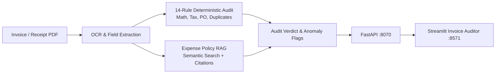

# LedgerLens — Financial Document AI & Automated Invoice Audit Platform

<div align="center">

[](https://www.python.org/)
[](https://fastapi.tiangolo.com/)
[](https://streamlit.io/)
[](https://mlflow.org/)
[](https://www.docker.com/)
[](https://github.com/astral-sh/ruff)
[](https://pytest.org/)
[](https://opensource.org/licenses/MIT)

</div>

> **Enterprise financial document AI platform combining automated multi-field invoice extraction, a 14-rule deterministic accounting validation engine, and corporate expense policy RAG with exact line citations.**

---

## 📖 Executive Summary & Value Proposition

**`ledgerlens`** is a production-grade, end-to-end machine learning system built with strict engineering discipline, reproducible pipelines, and enterprise MLOps best practices. It bridges the gap between theoretical statistical rigor and high-availability operational microservices.

## 🧾 Core Methodologies & System Architecture

### 1. Multimodal Field Extraction
- Extracts critical structured invoice headers and line items (Vendor Name, Tax ID, Invoice ID, Date, Line Quantities, Unit Prices, Subtotals, Tax Rates, Grand Total, Payment Terms) via bounding-box OCR and regex parsers.

### 2. 14-Rule Deterministic Accounting Validation Engine
- Verifies mathematical integrity: $\sum (	ext{Qty} 	imes 	ext{Price}) + 	ext{Tax} = 	ext{Grand Total}$.
- Executes strict compliance checks: duplicate invoice detection, purchase order cross-referencing, future date blocking, tax calculation verification, and vendor blacklist screening.

### 3. Accounting Policy RAG with Citations
- Semantic search across corporate procurement and travel & expense guidelines.
- Provides grounded compliance verdicts with verbatim policy citations and clause references.

## 📊 Architecture & Pipeline



## 🛠️ Tech Stack & Engineering Standards
- **Core Engine:** Python 3.12, PyPDF, Regex, Sentence-Transformers, BM25, Claude / Ollama
- **Serving & UI:** FastAPI, Streamlit, MLflow
- **Testing:** 100% Pytest pass rate across extraction, math validation, and policy QA


---

## 🚀 Quickstart & Setup Guide

### 1. Prerequisites & Environment Setup
Using **[uv](https://docs.astral.sh/uv/)** for lightning-fast, reproducible dependency resolution:

```bash
# Clone the repository
git clone https://github.com/jackson-marcus/ledgerlens.git
cd ledgerlens

# Install dependencies and pre-commit hooks
uv sync --group dev
```

### 2. Run Test Suite & Code Quality Checks
```bash
# Run unit & integration tests with coverage
uv run pytest --cov

# Run ruff linter and formatting checks
uv run ruff check .
uv run ruff format --check .
```

### 3. Launch Services Locally
```bash
# Start FastAPI REST API (listening on port :8070)
make api
# Or: uv run uvicorn ledgerlens.api.main:app --reload --port 8070

# Start interactive Streamlit dashboard (listening on port :8571)
make ui

# Launch local MLflow Experiment Tracking UI (listening on port :5007)
make mlflow
```

### 4. Run with Docker Compose
```bash
# Spin up the complete microservice stack
docker compose up --build
```

---

## 📂 Repository Layout

```
ledgerlens/
├── .github/workflows/ci.yml       # GitHub Actions CI pipeline (lint, test, build)
├── configs/                      # Configuration files and hyperparameters
├── data/                         # Data directory (raw, interim, processed)
├── scripts/                      # Data generators and operational scripts
├── src/ledgerlens/               # Core Python package
│   ├── api/                      # FastAPI routes, schemas, and endpoints
│   ├── models/                   # Statistical models, ML algorithms, and estimators
│   ├── ui/                       # Streamlit interactive application
│   └── settings.py               # Centralized configuration & environment loader
├── tests/                        # Comprehensive Pytest suite
├── docker-compose.yml            # Multi-service container orchestration
├── Dockerfile                    # Container definition for API service
├── Makefile                      # Standardized project tasks
└── pyproject.toml                # Pinned dependencies and tool configs
```

---

## 👤 Author & Contact

**Jackson Marcus**
- **Email:** [jackson.marcus.work@gmail.com](mailto:jackson.marcus.work@gmail.com)
- **Upwork:** [Jackson Marcus on Upwork](https://www.upwork.com/freelancers/~012235717501ad9c7b)
- **GitHub:** [@jackson-marcus](https://github.com/jackson-marcus)

*Available for machine learning engineering, MLOps, data science, and AI system architecture consulting and contract engagements.*

