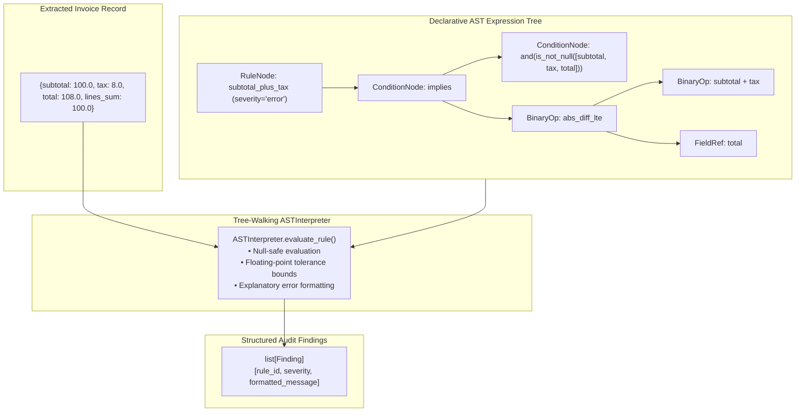

# LedgerLens — Invoice AI & Audit (Declarative Rules Engine DSL)

<div align="center">

[](https://www.python.org/)
[](https://fastapi.tiangolo.com/)
[](https://streamlit.io/)
[](https://mlflow.org/)
[](https://www.docker.com/)
[](https://github.com/astral-sh/ruff)
[](https://pytest.org/)
[](https://opensource.org/licenses/MIT)

</div>

> **Financial document AI and automated invoice audit engine powered by a Declarative Domain-Specific Language (DSL) and Tree-Walking AST Interpreter — executing deterministic accounting rules, mathematical reconciliations, and expense policy RAG.**

---

## 🏛️ Architecture Pattern: Declarative Rules Engine DSL + AST Interpreter

Hardcoding accounting validation logic in python `if-else` blocks causes audit rule drift, lacks explanation transparency, and requires code deployments for routine policy updates.

`ledgerlens` compiles audit policies into an **Abstract Syntax Tree (AST)** evaluated by a pure tree-walking interpreter:



### AST Expression Grammar
- **`FieldRef`**: Resolves dynamic fields from invoice context with null safety.
- **`Literal`**: Constant scalar floats, integers, or strings.
- **`BinaryOp`**: Arithmetic operators (`+`, `-`, `*`, `/`) and comparisons (`==`, `<`, `<=`, `>`, `>=`, `abs_diff_lte`).
- **`ConditionNode`**: Boolean logic operators (`and`, `or`, `not`, `implies`, `is_not_null`).
- **`RuleNode`**: Combines AST conditions with error severity and message interpolation templates.

### Module Organization
- **`rules_engine/ast_nodes.py`**: Typed immutable AST node hierarchy.
- **`rules_engine/interpreter.py`**: Pure tree-walking `ASTInterpreter` with tolerance arithmetic.
- **`rules_engine/engine.py`**: `DeclarativeRulesEngine` managing rulesets and audit workflows.
- **`extraction/`**: Multimodal field extraction from digital/scanned PDFs.
- **`rag/`**: Expense policy retriever with exact line provenance citations.

---

## 🧾 Core Methodologies & Financial Validation

### 1. Mathematical Reconciliation Rules
- Subtotal Integrity: $|\sum (\text{Qty}_i \times \text{Price}_i) - \text{Subtotal}| \le \epsilon$
- Grand Total Integrity: $|(\text{Subtotal} + \text{Tax}) - \text{Grand Total}| \le \epsilon$
- Tax Rate Sanity: $\frac{\text{Tax}}{\text{Subtotal}} \le \text{MaxTaxRate}$

### 2. Expense Policy RAG with Line Citations
- Semantic search across corporate procurement and travel & expense guidelines.
- Grounded compliance verdicts citing verbatim clause references.

---

## 🚀 Quickstart & Setup Guide

```bash
git clone https://github.com/jackson-marcus/ledgerlens.git
cd ledgerlens

$env:UV_CACHE_DIR = "D:\ml-projects\.uv-cache"
uv sync --group dev

# Run unit tests and AST rule engine verification
uv run pytest -q
uv run ruff check .

# Launch FastAPI (port :8070) + Streamlit auditor (port :8571)
make api
make ui
```

---

## 📂 Repository Layout

```
ledgerlens/
├── configs/                      # Accounting tolerance & validation rules configs
├── data/                         # Sample invoice PDFs and synthetic benchmarks
├── src/ledgerlens/               # Core Python package
│   ├── rules_engine/             # Declarative Rules DSL: AST nodes, interpreter, engine
│   ├── validation/               # Validation adapter layer
│   ├── extraction/               # OCR and invoice field parsing
│   ├── rag/                      # Corporate expense policy retriever
│   ├── api/                      # FastAPI REST routes
│   └── ui/                       # Streamlit interactive invoice workspace
├── tests/                        # Comprehensive Pytest suite covering AST rules and RAG
├── docker-compose.yml
└── pyproject.toml
```

---

## 👤 Author & Contact

**Jackson Marcus**
- **Email:** [jackson.marcus.work@gmail.com](mailto:jackson.marcus.work@gmail.com)
- **Upwork:** [Jackson Marcus on Upwork](https://www.upwork.com/freelancers/~012235717501ad9c7b)
- **GitHub:** [@jackson-marcus](https://github.com/jackson-marcus)

---

## 👨‍💻 Author & Maintainer

<div align="center">

### **Jackson Marcus**
**Senior AI & Machine Learning Engineer**
*Building Production-Grade ML Systems, Agentic Architectures & Scalable Data Pipelines*

[](https://github.com/jackson-marcus)
[](https://www.upwork.com/freelancers/~012235717501ad9c7b)
[](mailto:wajahatanees41@gmail.com)

📍 *Byron, GA, USA*

</div>
